## Organiserad kreativitet

- 2001
- 2007
- 2010
- 2018

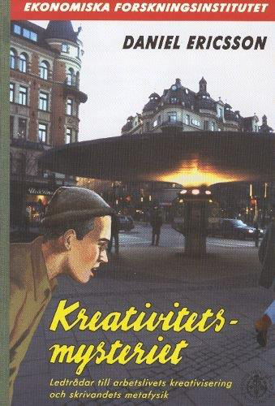

---

## Dagens agenda

- Presentera fyra perspektiv på organisation (och ledarskap) utifrån
- Jesper Blombergs bok ”Management”
- – med ett fokus på projekt
- – och med ett genusperspektiv på de fyra perspektiven

---

## Management: En utgångspunkt

- “Problemet”: Att få människor att tillsammans åstadkomma det som de annars inte skulle åstadkomma…
- “Lösningen”: Samordnad handling
- Organisation: Alla de arenor i samhället där organisering sker i en tydligt avgränsad form.
- Ledarskap: Alla de krafter som på ett eller annat sätt bidrar till att människor organiserar sig.

---

## Några olika organisations-”typer”

- Och så projekt förstås!

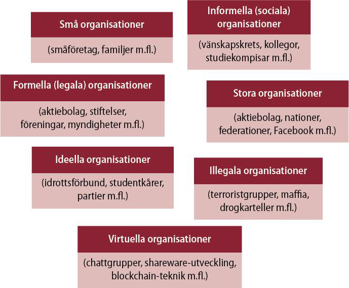

---

## Olika ledarskaps-”typer”

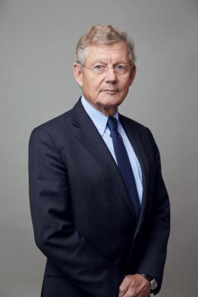

---

## Bokens filosofiska & teoretiska ”kärna”

- Perspektivseende
- Perspektivväxling

---

## Kunskap: Vad vi vet och vad vi uppfattar är alltid relativt ett perspektiv

- Vad vi uppfattar som ett problem är beroende av vårt perspektiv
- Om vi byter perspektiv kan ett problem till och med omvandlas till en lösning
- Perspektiv är nödvändiga för att vi ska kunna se något överhuvudtaget, men de förblindar oss också
- För att möjliggöra för oss att byta perspektiv/inte fastna i ett perspektiv, behöver vi hjälp
- Teorier och teoretiska perspektiv utgör en sådan hjälp

---

## Fyra perspektiv på organisation och ledarskap

- Strukturperspektivet
- (rationella system & formella processer)
- ”Moderna”
- Normativa
- Funktionalism
- HR-perspektivet
- (mänskliga resurser & motivation)
- Maktperspektivet
- (konflikt, politik & förhandling)
- ”Nutida”
- Deskriptiva, kritiska
- Relativism
- Symbolperspektivet
- (mening, identitet, kultur & normer))

---

## Framgångsrik organisering enligt strukturperspektivet

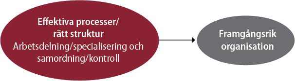

---

## Framgångsrik organisering enligt HR- perspektivet

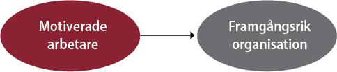

---

## Framgångsrik organisering enligt maktperspektivet

- Page 12

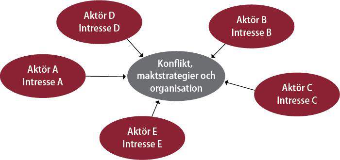

---

## Framgångsrik organisering enligt symbolperspektivet

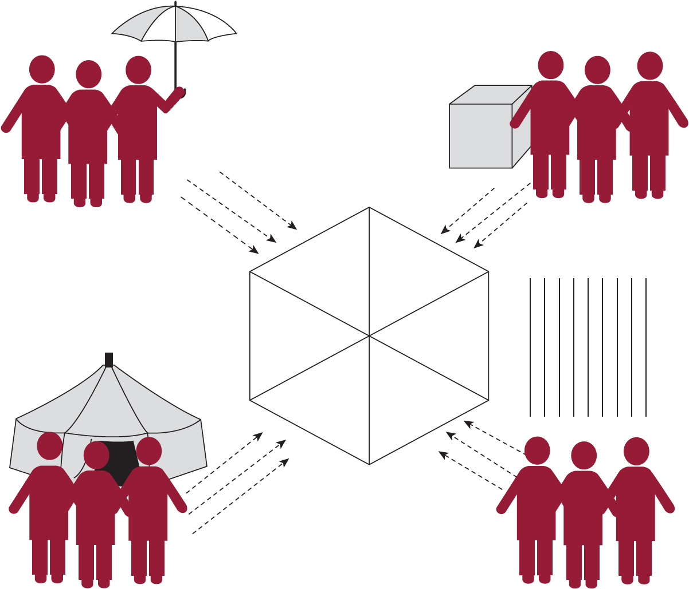

---

## Perspektivväxling

- Ju fler perspektiv vi har att tillgå, desto bättre!
- – Bättre förståelse
- – En utökad tanke- och handlingsrepertoar
- – Bättre beslut
- – Bättre agerande

---

## Analysstrategi

- Att ställa det som empiriskt ”är”…
- … mot det som teoretiskt ”bör” vara

---

## STRUKTURPERSPEKTIVET

---

## Är vs bör-frågor utifrån ett strukturperspektiv

- 1) Vilken struktur har organisationen?
- 2) Vilken struktur bör organisationen ha?
- 1) vs 2): Omstrukturering?

---

##

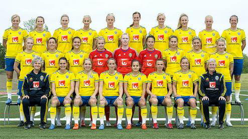

---

## Samhället = en strukturerad historia

---

## ”Det strukturella problemet”: Samordnad handling

- Arbetsdelning – specialisering – koordinering –
- – Vem ska göra vad? A gör a; B gör b; C gör c…
- – Hur förhålla A/a till B/b till C/c…?
- – Hur koordinera A/a till B/B till C/c…?
- Organisation från grekiskans organon, ”verktyg”, ”redskap”
- Chef/ledaren som ”redskapshanterare”

---

## Teoretiska föregångare/strömningar

- Organisationer i industriell utveckling
- – Privata företag och statlig administration
- Sociologi
- – Max Weber
- Klassisk managementteori
- – Scientific management; Frederick W Taylor, Henri Fayol

---

## Den byråkratiska skolan

- Max Weber, sociolog, lanserade idéer om den byråkratiska
- ”idealtypen”
- – Rationell auktoritet (opartisk, objektiv) framför karisma och tradition
- – Hierarki med strikt ansvarsfördelning
- – Styrning genom regler och procedurer
- – Reglerad befordringsgång, meritokrati

---

## Scientific Management

- Frederick W. Taylor, ingenjör och industriledare
- The Principles of Scientific Management (1911)
- – Hantverksmässiga ’tumregler’ inte tillräckligt effektiva
- – Funktionell arbetsdelning - ’huvudet i topp och fötterna på marken’
- – Specialisering och övervakning av arbetsprocesser
- – Tidsstudiemän
- – ”Rätt man på rätt plats”

---

## Den administrativa skolan

- Henri Fayol, ingenjör och industriledare: General and Industrial
- Management (1919)
- – 14 principer för rationell administration, bl a
- – enhetlig befälsordning
- – ansvar och auktoritet
- – centralisering
- – organisationsscheman
- – löpande avrapportering

---

## Grundläggande antaganden

- Organisationer existerar för att man skall kunna nå uppställda mål.
- Organisationen förbättrar effektivitet och utfall genom specialisering och tydlig arbetsfördelning.
- Lämpliga samordnings- och kontrollformer säkerställer att olika individers och enheters ansträngningar kopplas samman.
- Organisationer fungerar bäst då rationaliteten ges företräde framför personliga preferenser och yttre tryck.
- Strukturerna måste utformas på ett sådant sätt att de passar organisationens villkor (exempelvis vad gäller mål, teknologi, arbetsstyrka och omgivning).
- Problem och försämrade prestationer uppstår till följd av strukturella svagheter och kan åtgärdas med hjälp av analys och omstrukturering.

---

## Tre grundläggande aspekter

- Rationell...
- … arbetsdelning (tydlig roll- och ansvarsfördelning) och
- samordning (tydliga kommunikations- och beslutsvägar)
- … ger inre och yttre effektivitet
- Inre effektivitet - att göra saker rätt (efficiency)
- Yttre effektivitet - att göra rätt saker (effectiveness)

---

## Arbetsdelning

- ...kan ske efter:
- •
- Funktion (kunskaper och färdigheter)
- •
- Tid
- •
- Produkt/marknad
- •
- Klient/kund
- •
- Plats/geografi
- •
- Process

---

## Samordning I

- … kan ske vertikalt genom
- Makt/hierarkisk position
- Regler och policies
- Planerings- och kontrollsystem

---

## Samordning II

- … kan ske lateralt genom
- Möten
- Projektgrupper
- Samordningsroller
- Matrisstrukturer
- Nätverk

---

## Strukturella konfigurationer, H Mintzberg

- Strategisk topp
- Stöd- funktion
- Tekno- struktur
- Mellan- chefer
- Operativ kärna

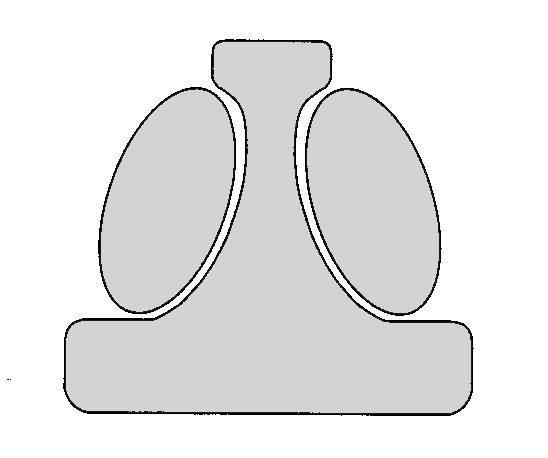

---

## Enkel struktur

- Struktur:
- Enkel
- Typ av org.:
- Små företag
- Styrkor:
- Flexibel
- Svagheter:
- Obenägenhet till förändring

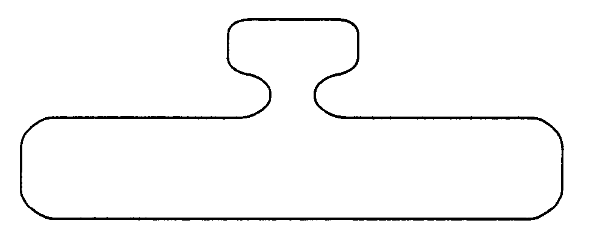

---

## Maskinbyråkrati

- Struktur:
- Formaliserade och specialiserade roller/rutiner
- Typ av org:
- Producenter av standardiserade varor/tjänster
- Styrkor:
- Främjar inre effektivitet, enhetlighet och förutsägbarhet
- Svagheter:
- Trögrörlig

---

## Professionsbyråkrati

- Struktur:
- Decentraliserad
- Typ av org:
- Professions-organisationer
- Styrkor:
- Inre och yttre effektivitet på decentraliserad nivå
- Svagheter:
- Samordning och kontroll försvåras

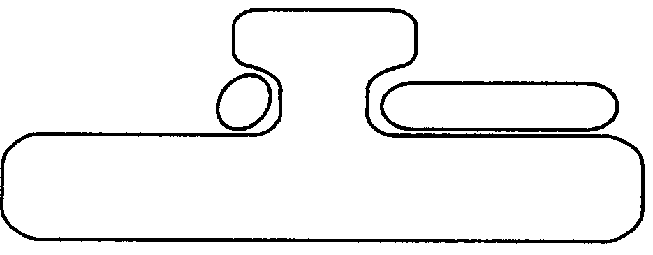

---

## Divisionaliserad form

- Struktur:
- Divisionaliserad (ex produkt,marknad)
- Typ av org:
- Konglomerat med många produkter/ tjänster
- Styrkor:
- Anpassningsbar, kan utnyttja synergier och resurser
- Svagheter:
- Risk för konflikter och kortsiktighet

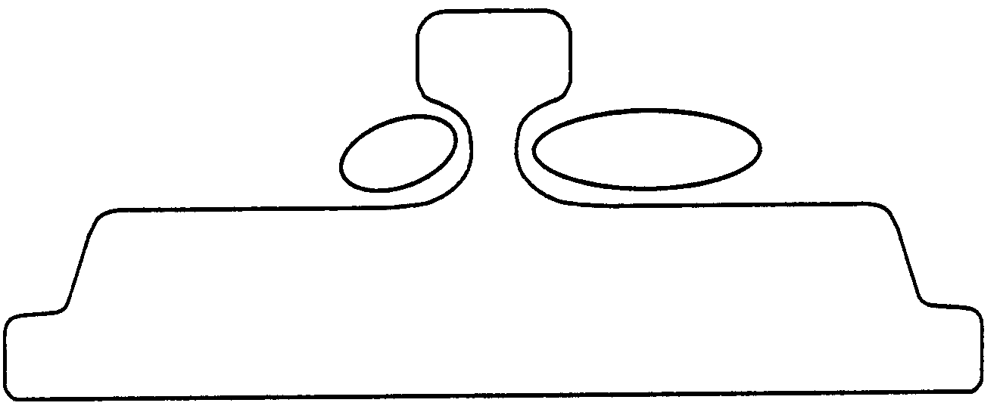
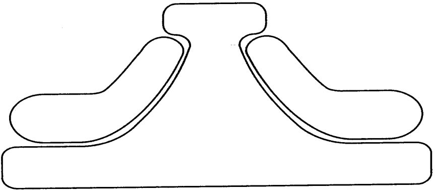

---

## Adhocrati

- Struktur:
- ’Organisk’, temporär
- Typ av org:
- Temporära organisationer; projekt
- Styrkor:
- Innovativ och föränderlig i enlighet med skiftande krav
- Svagheter:
- Resurskrävande, svårkontrollerbar

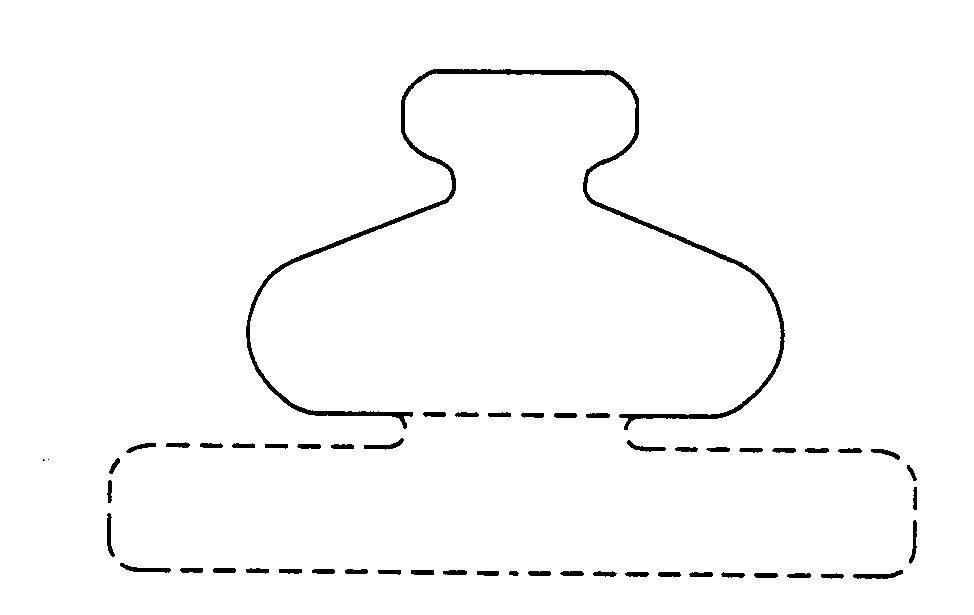

---

## Vilken struktur bör organisationen ha?

- Dimensioner och situationsberoenden
- Dimension
- Situationsberoende
- Storlek och ålder
- Ju större och äldre verksamhet, desto mer formaliserade processer och hierarkiska strukturer
- Centrala processer och kärnteknologi
- Ju högre grad av komplexitet i centrala processer och kärnteknologi, desto mindre formalisering och hierarki
- Omgivning
- Ju högre osäkerhet och turbulens i omgivningen, desto mindre formalisering och hierarki
- Strategi
- Ju mer ”hi-end”, det vill säga hög kvalitet och högteknologi, desto mindre formalisering och hierarki
- Informationsteknologi
- Ju mer utvecklad informationsteknologi, desto mer decentraliserad organisation och mindre antal mellanchefer, men även mer centralisering och vertikal kontroll
- Arbetskraft
- Ju mer högutbildad och kunnig arbetskraft, desto mindre formalisering och hierarki

---

## Omstrukturering I

- Interna drivkrafter
- Strategisk ledning eftersträvar centralisering
- Mellanchefer eftersträvar decentralisering
- Teknostrukturen eftersträvar standardisering
- Staben eftersträvar samarbete
- Operativa kärnan eftersträvar större frihet och mindre påverkan från andra i organisationen

---

## Omstrukturering II

- Externa drivkrafter - anpassning till...
- Förändringar i omgivningen
- Förändrad teknologi
- Ny chef
- Organisatorisk tillväxt

---

## HR-PERSPEKTIVET

---

## Men hallå?! Var är människorna?

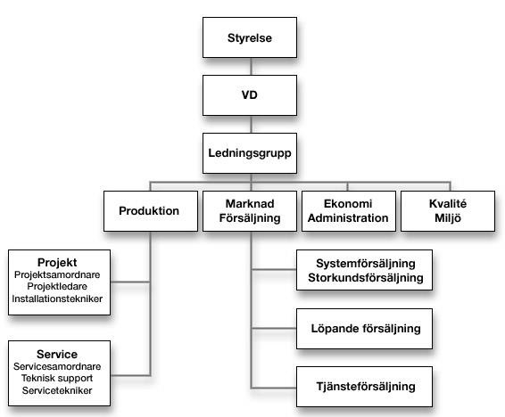

---

## Kritiken mot strukturperspektivet

- Människosyn
- ”Ett av de viktigaste kraven på en man som lämpar sig till att hantera tackjärn som fast yrke är att han skall vara så dum och flegmatisk att han mentalt sett mer liknar en oxe än någon annan typ” (Taylor, 1911/1913, s. 59, min översättning)
- ”Rätt man på rätt plats”

---

## HR-klassiker

- I Robert Owens och Karl Marx fotspår…
- Hugo Münsterberg (1912):
- – ”Rätt man på rätt plats” genom psykologiska tester
- Elton Mayo
- – Hawthornestudien (1927)
- Human Relations-skolan
- – Prestation Testad förmåga
- – Psykosocial tillfredsställelse viktigare än ”förmåga”
- – Kollektiv handling viktigare än individuell handling
- – Arbetsledning: rådgiving ”ansikte mot ansikte”

---

## HR-perspektivet i perspektiv

- Två breda, parallella utvecklingslinjer:
- etik (Human Relations i Europa) vs effektivitet (HRM i USA)
- Gradvis förskjutning från psykologi till sociologi (socialpsykologi) till organisations/ledarskapsteori
- Gradvis humanisering av arbetslivet, dock med backlash
- – De flesta (?) närmar sig idag HR utifrån ett amerikanskt perspektiv i kölvattnet av den finansiella krisen…  ”Lean and mean”
- – Den svenska modellen...
- – Idag: idéhistorisk legering med mycket stort genomslag i företagspraktiken

---

## HR-perspektivet grundläggande antaganden

- Organisationer ska tillfredsställa mänskliga behov
- (Organisationer finns till för att uppfylla människors behov, inte tvärtom)
- (Människor och organisationer behöver varandra. Organisationerna behöver idéer, energi, kunskaper och färdigheter; människor behöver lön och möjligheter att utvecklas och göra karriär)
- Organisationers & människors behov måste stämma överens
- (När överensstämmelsen mellan individ och system är dålig blir minst en av parterna lidande. Antingen utnyttjar organisationen människorna eller tvärtom, eller så går båda förlorande ur spelet.
- När överensstämmelsen mellan individ och system är god tjänar båda parter på det.
- Individen får ett meningsfullt arbete som skänker dem tillfredsställelse och organisationen får den kunskap och energi som krävs för att lyckas.)
- Människan är en komplex biologisk och (social)psykologisk varelse

---

## • Matchning av behov!

- B
- E
- VD
- T
- E
- Division 1
- Division 2
- Division 3
- E
- N
- D
- E
- Vilka behov har då människor och organisationer?

---

## Organisationsbehov?

- Fråga 1:
- Kan man verkligen säga att organisationer har behov?
- Fråga 2:
- Vem definierar organisationens behov?
- Notera:
- Den organisatoriska behovsanalysen lyser allt som oftast med sin frånvaro! Det tas för givet att organisationer behöver idéer, kunskaper och energi.

---

## Vilka behov har medarbetare?

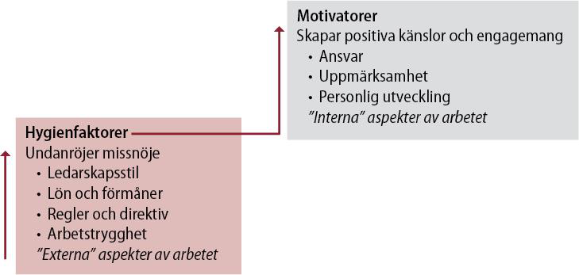
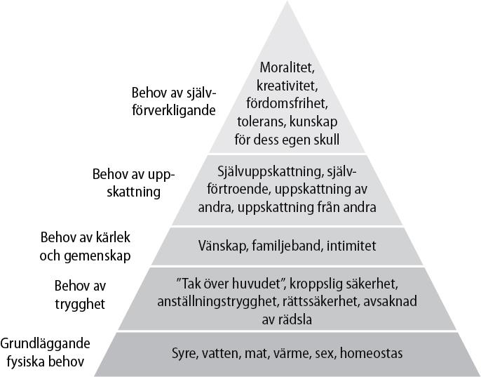
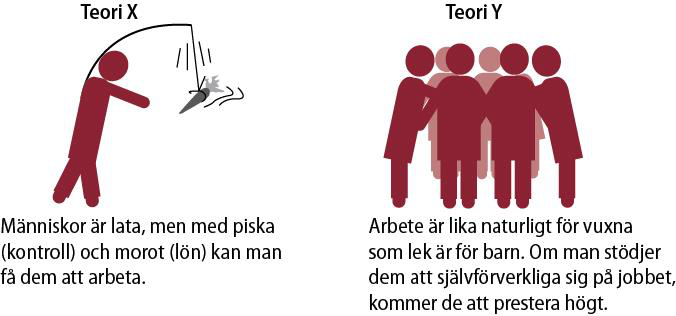

---

## Chefsskap

- (management) kontra ledarskap

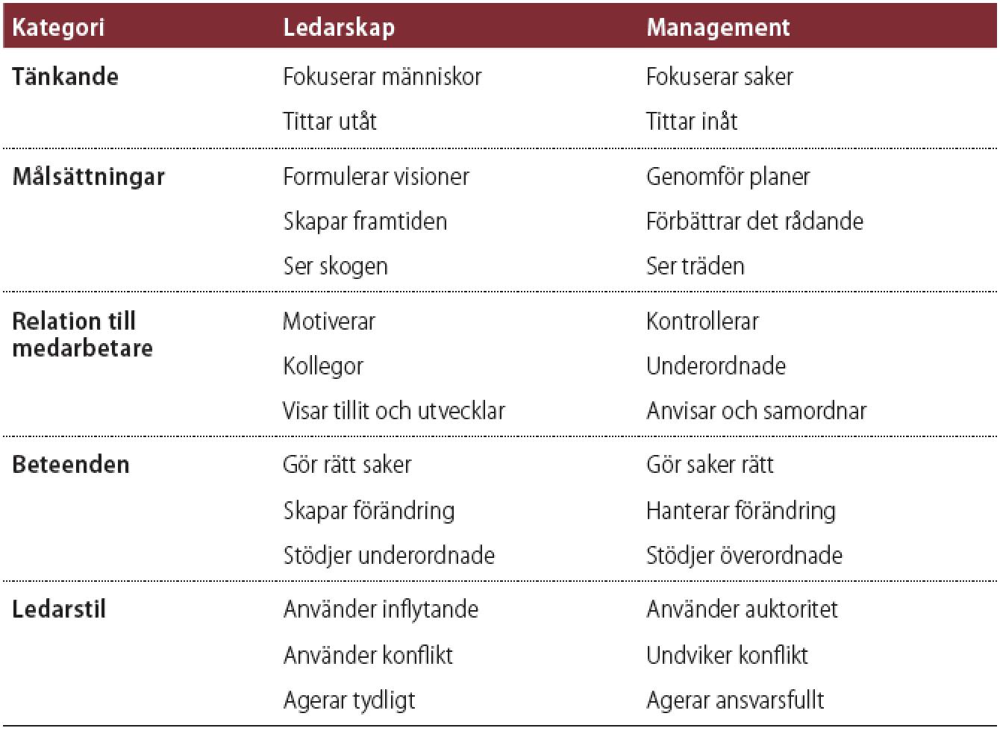

---

## Är vs bör-frågor utifrån ett HR-perspektiv

- •1) Vilka behov har medarbetarna i organisationen respektive organisationen? Tillgodoses de?
- •2) Vilka behov bör medarbetarna i organisationen respektive organisationen ha? Tillgodoses de?
- •1) vs 2) Behövs en ny HR-strategi?

---

## Två grundläggande HR-strategier

- Investera i människor: Human Resources
- Ansvarsfördelning och omstrukturering av arbetet:
- Human Relations

---

## Investera i människor

- … att anställa rätt personer och att belöna dem på ett riktigt sätt
- – Rekrytera och belöna
- – Att ge trygghet
- – Internrekrytering
- – Utbildning och kompetensutveckling
- – Vinstdelning

---

## • Affärsidé vs Personalidé

- Personalidé
- – Imageidé
- – Rekryteringsidé
- – Utvecklingsidé
- – Avvecklingsidé

---

## Investeringsrationalitet

- Investering - avkastning
- Människan = en resurs vilken som helst, d v s förbrukbar
- Human Resource Management: ”Moderniteten i ett nötskal”
- – Identifikation
- – Segregation
- – Hierarkisering

---

## Ansvarsfördelning och omstrukturering av arbetet

- Investera i människor inte tillräckligt för att skapa engagemang.
- Arbetet i sig måste innehålla:
- – Självständighet och medinflytande
- – Arbetsberikning och resursutnyttjande
- – Lagarbete
- – Demokrati och jämlikhet

---

## Kritik mot HR-perspektivet

- Romantisk syn på människan?
- Naiv syn på matchning?
- Akademiska medelklassvärderingar?
- Ignorerar individuella olikheter?
- Går maktens cyniska ärenden?
- Utnyttja resurser eller respektera människan som social varelse?

---

## HR-perspektivets skakiga empiriska stöd

- HR-perspektivet antar:
- Vissa studier visar:

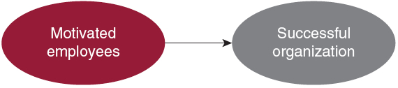
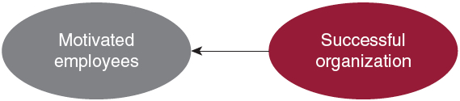

---

## MAKTPERSPEKTIVET

---

## Makt – ett ”knepigt” begrepp med en ”knepig” historia

- Makt är att få någon att göra något som han/hon annars inte skulle göra.
- (Dahl, 1958)
- Makt är den ”potentiella förmågan att påverka beteenden, ändra handlingsförlopp, övervinna motstånd, och få människor att göra sådant som de annars inte skulle ha gjort.” (Pfeffer, 1992, B&D, s 234-235)
- Makt handlar om ”förmågan att få någonting gjort.” (Bolman och Deal, s.
- 234)
- Makt är produktiv; den producerar verklighet (Foucault, 1975)

---

## Några viktiga maktaspekter

- Auktoritet vs. makt
- Mikromakt vs makromakt
- Partikulär vs universell
- Öppen eller dold makt
- Makt att vs. makt över…
- … makt över tanken

---

## Maktperspektivets grundantaganden

- Organisationer är koalitioner som består av många olika och olikartade individer och intressegrupper.
- Mellan koalitionsmedlemmarna finns det bestående skillnader i värderingar, åsikter, information, intressen och tolkningar av verkligheten.
- Huvuddelen av alla viktiga beslut handlar om fördelning av knappa resurser, dvs om vem som får vad.
- Knappa resurser och bestående skillnader ger konflikter en central plats i organisationsdynamiken och gör makt till den viktigaste tillgången.
- Mål och beslut växer fram genom förhandling, köpslående och tävlande om bra positioner mellan konkurrerande intressenter.

---

## Är vs bör-frågor utifrån ett maktperspektiv

- 1) Hur är makten fördelad i organisationen?
- Förekommer öppna maktkamper?
- 2) Hur borde makten vara fördelad i organisationen?
- Borde det förekomma öppna maktkamper? ’
- 1) vs 2): Bör makten omfördelas?

---

## Hur är makten fördelad i organisationen?

- Vem/vilka besitter olika maktbaser?

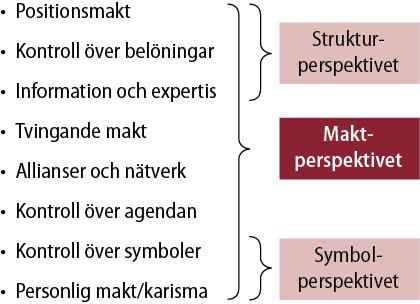

---

## Förekommer konflikt och kamp?

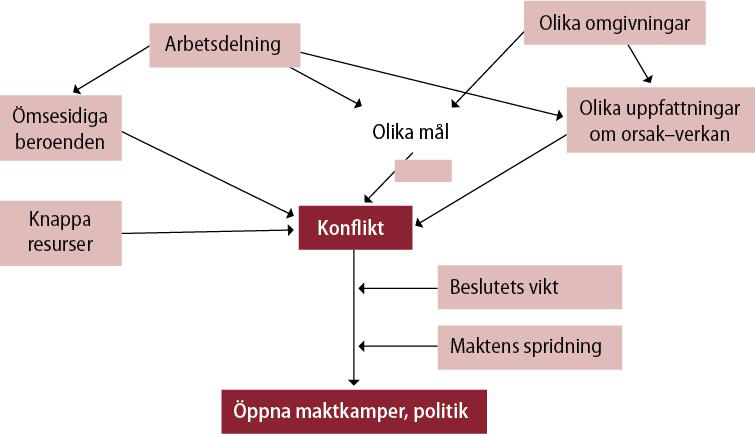

---

## Olika typer av konflikt

- Horisontella konflikter
- – Differentiering – integrering
- – Olika mål/intressen mellan olika enheter
- – Beroenden mellan uppgifter, grupper och koalitioner
- – Resursfördelning mellan olika enheter
- Vertikala konflikter
- – Top/down

---

## Maktfördelning - konflikter - politik

- Överdeterminerade system
- Underdeterminerade system
- När intressen kolliderar = konflikt
- – För mycket eller lite?
- Politik = konflikthantering

---

## Maktens dubbla organisatoriska dimensioner

- Organisationer som politiska arenor
- Organisationer som politiska aktörer

---

## Kritik mot maktperspektivet

- Cyniskt?
- Gör allting till politik?

---

## SYMBOLPERSPEKTIVET

---

## Symboler och deras verkan

- Symbol: Från grekiskan, ’tecken’
- Representation: Vi ser något som något för att gestalta det symbolen inte är, för att därigenom förstå det bättre.

---

## Symbolperspektivets grundläggande antaganden

- Det viktiga är inte vad som händer utan vad det betyder.
- Aktivitet och mening är löst kopplade till varandra – händelser får olika mening därför att människor tolkar erfarenheter på olika sätt.
- För att kunna hantera den osäkerhet och mångtydighet som vi ställs inför i våra dagliga liv skapar vi människor symboler som minskar förvirringen, ökar förutsägbarheten och gör det möjligt att finna en riktning och förankra hopp och tro.
- Många händelser och processer är av större vikt för det som uttrycks än för det som produceras. De bildar en kulturell gobeläng av sekulariserade myter, hjältar och hjältinnor, ritualer, ceremonier och historier som hjälper människor att finna glädje och mening både privat och i arbetslivet.
- Kultur är det kitt som håller samman organisationer och som samlar människor kring en gemensam uppsättning värderingar och övertygelser.

---

## Är vs bör-frågor utifrån ett symbolperspektiv

- 1) Vad för slags kultur råder i organisationen?
- Innehåll? Stark eller svag? Homogen eller heterogen?
- 2) Vad för slags kultur borde råda i organisationen?
- Innehåll? Stark eller svag? Homogen eller heterogen?
- •1) vs 2) Behövs en kulturförändring?

---

## Edgar Scheins definition av kultur

- “… ett mönster av grundläggande antaganden som en grupp har lärt sig då den löst sina problem med anpassning till omgivningen och intern samordning, på sätt som fungerat bra nog att uppfattas som riktiga och därför lärs ut till nya medlemmar som det rätta sättet att erfara, tänka och känna i relation till de problemen.”
- (Schein 2004, s. 17)

---

## Vad för slags kultur har organisationen?

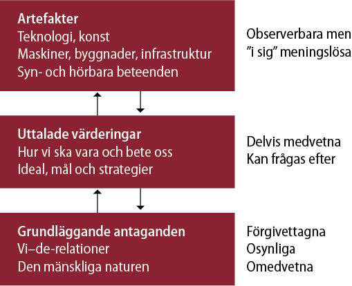

---

## Olika typer av organisationssymboler

- Myter, visioner och värderingar
- Hjältar och hjältinnor
- Historier, berättelser, sagor
- Vanor och ritualer
- Ceremonier
- Metaforer, humor, lek

---

## Organisation som teater

- Infria förväntningar, skapa legitimitet och mening
- – Attrahera betalande publik (kunder, investerare, leverantörer etc)
- Organisatoriska strukturer och processer
- – Ha ”rätt” roller
- – Spela ”rätt” repertoar och ha ”rätt” rekvisita
- Exempel på teaterföreställningar:
- – Möten
- – Strategidokument (”mission” och ”vision”)
- – Jämställdhetsplaner
- – Utvärderingar
- – Medarbetarenkäter

---

## Kritik mot symbolperspektivet

- Allt för stark betoning på det gemensamma. Alla sitter inte ”i samma båt’.
- Bristande legitimitet i en alltjämt rationalistiskt definierad värld.

---

## Genusperspektiv på de fyra perspektiven

---

## Genusperspektiv på strukturperspektivet

- Strukturperspektivet är i grunden ”könsblint”
- Strategisk
- Var finns kvinnor och män i organisationernas strukturer?
- topp
- Yvonne Hirdmans ”könsmaktsordning”
- – Kvinnor och män är segregerade och
- Stöd- funktion
- Tekno- struktur
- Hierarkiserade i samhället
- – Mannen är norm
- Mellan- chefer
- Arbetsdelningen är könsmärkt
- Roller, organisationer och branscher är könsmärkta
- Operativ kärna
- Gruppers sammansättning majoritet/minoritet
- – Synlighet, kontrast, assimilering
- Rosabeth Moss Kanter Men and Women of the Corporation (1977)
- Wahl, m fl (2001: 68ff och 108-110)

---

## Genusperspektiv på HR-perspektivet

- Vems behov tillgodoses i organisationer?
- Antas kvinnor och män ha olika behov?
- – Ges män och kvinnor lika lön för lika arbete?
- Ges kvinnor och män samma möjligheter?
- Är ”kompetens” ett könsneutralt fenomen?
- ’Glastaket’ (Breaking the glass ceiling, Morrison, White and van Velsor 1987)
- – Stressen av att vara föregångare
- – Stressen av att ta dubbelt ansvar (arbete och familj)
- – Framgång kräver anpassning till status quo

---

## Genusperspektiv på maktperspektivet

- Hur är makten fördelad mellan män och kvinnor i organisationer?
- – Maktbaser?
- – Formell makt?
- – Informell makt?
- Könsneutrala tolkningsföreträden och problemformuleringsprivilegier?
- ”Homosocialitet” – könsmaktsordningens reproduktion

---

## Genusperspektiv på symbolperspektivet

- Könsmärkta kulturer?
- – Artefakter
- – Värderingar
- – Grundläggande antaganden
- Att se företeelser som symboler för rationalitet och tradition reproducerat av (och för) män?
- Mannen som (kulturell) norm – Kvinnan som normbrytare
- – Tokenism
- Språkets gestaltande karaktär
- – Hur skildras fenomen?

---

##

---

## {.attribution-slide}

### Erkännande

Detta material är anpassat från en föreläsning av **Daniel Ericsson**, Institutionen för kulturvetenskaper, Lunds universitet, 2024.
