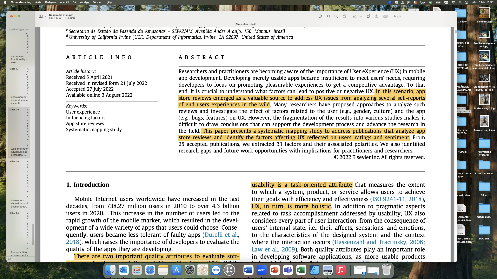
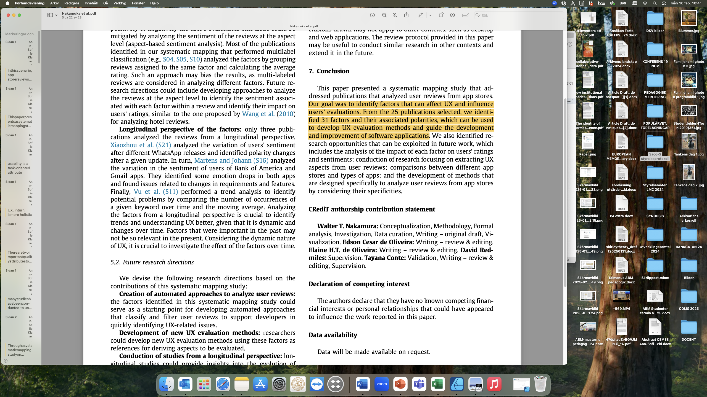
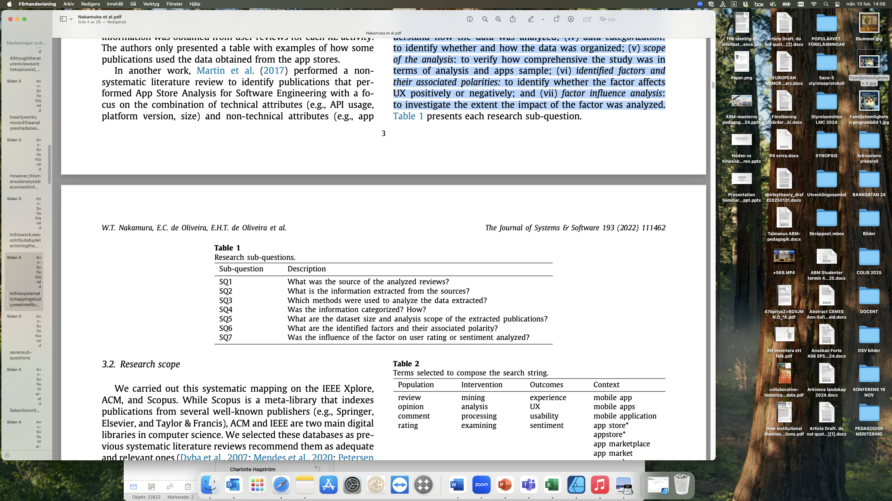

## Uppgift 1

---

## Uppgift: utvärderingsrapport

- Kursens andra examinationsuppgift görs i samma grupper som utvärderingsplanen. Uppgiften utgörs av en skriftlig avrapportering av den utvärdering som ni har genomfört. Rapporten ska innehålla följande:
- Inledning (här bör anges vilken digital tjänst som utvärderats och i vilken användningskontext, samt vem rapporten i första hand riktar sig till)
- Bakgrund (beskrivning av tjänsten, användargrupper i den aktuella användningskontexten samt motivering för utvärderingen)

---

## Uppgift: utvärderingsrapport (forts.)

- Syftet med utvärderingen
- Frågeställningar som utvärderingen besvarar
- Redogörelse för hur utvärderingen genomförts
- Resultat (vad visar undersökningarna?)
- Analys och diskussion av resultaten
- Konklusion
- Förslag till förbättringar
- Källförteckning (i alfabetisk ordning)

---

## Digitala tjänster

- Skånetrafikens app
- Hinge
- Klarna
- 1177:s chattbot
- Voi
- Airwallet

---

## Formulera syfte & frågeställningar

- Syftet ska ange vad som ska utvärderas
- Frågeställningarna ska vara tydligt relaterade till syftet
- Frågeställningarna ska hjälpa er att uppnå syftet

---

## Syfte & frågeställningar

- Exempel: Syftet med utvärderingen är att förstå användarupplevelsen för kvinnor mellan 20-25 år i Skåne som använder Hinge för att hitta en partner.
- Förslag: Syftet med utvärderingen är att undersöka hur användarupplevelsen för kvinnor mellan 20-25 år i Skåne som som använder Hinge för att hitta en partner kan förbättras.
- Förslag till primär frågeställning: Vilka utmaningar upplever användarna vid användning av appen och hur kan Hinge göra för att appen ska bli bättre för denna målgrupp?

---

## Användningskontext och målgrupp

- Generellt: avgränsa er till en användningskontext och en målgrupp
- Exempel: Dem som förlitar sig på den varje dag, de som måste lita på att biljetterna är lätta att köpa och att realtidsinformationen faktiskt stämmer. Sedan har vi de som bara använder den någon gång ibland och kanske inte är lika vana vid gränssnittet – är den lika lätt att förstå för dem, eller blir det krångligt? Turister är en annan viktig grupp. Om man aldrig har åkt kollektivt i Skåne tidigare, är appen tillräckligt tydlig för att hjälpa en att hitta rätt? Och så finns nattresenärerna – de som behöver kollektivtrafiken när den går som mest sällan. Hur väl fungerar appen när man står där på en mörk busshållplats och väntar? En annan viktig aspekt är tillgängligheten. Hur fungerar appen för personer med syn-, hörsel- eller rörelsenedsättningar?
- Förslag: Väl en av dessa grupper som ni utgår ifrån i er syftesformulering

---

## Användningskontext och målgrupp

- Exempel: För att hålla undersökningen smal och fokuserad kan vi identifiera tre huvudsakliga användargrupper inom målgruppen kvinnor mellan 20-25 år i Skåne som använder Hinge för att hitta en partner.
- Kommentar: Detta är en målgrupp och den fungerar mycket bra i sammanhanget.

---

## Användningskontext och målgrupp

- Exempel: Målgrupp: kvinnor i åldern 18-25 år som använder Klarnas betaltjänster.
- Huvudsyfte: Att analysera om en sänkning av beloppsgränsen för kvinnor mellan 18-25 år kan minska antalet skuldsättningar hos Kronofogden. Utvärderingen ska också besvara frågor som: Hur påverkar nuvarande beloppsgränser unga kvinnors skuldsättning? Finns det ett samband mellan högre kreditgränser och ökad ekonomisk utsatthet? Vilka potentiella effekter kan en sänkning ha på användarnas köpbeteende?
- Förslag: Avgränsa er till huvudsyftet, det är tillräckligt inom kursens ramar.

---

## Utvärderingsmodeller

- Exempel: Ekonomisk, komparativ, resultatinriktad och aktörsfokuserad
- Förslag: välj en av dessa, möjligen två
- Medskick: ni behöver använda en kvalitativ och en kvantitativ metod.

---

## Syfte

- Exempel: Syftet med utvärderingsplanen är att ta reda på om 1177s chattfunktion uppfyller de krav och önskemål som den utger sig för att göra, samt hur väl den bemöter användares och vårdpersonalens önskemål. Vidare finns ett intresse att utvärdera huruvida chattfunktionen kan vara att föredra över traditionella kontaktvägar.
- Förslag: Här finns tre syften. Det räcker med ett. Möjliga frågeställningar:
- Uppfyller 1177:s chattfunktion de krav som den utger sig för att göra?
- Hur väl möter 1177:s chattfunktion användares önskemål?
- Hur väl möter 1177:s chattfunktion vårdpersonalens önskemål?
- Hur väl står sig 1177:s chattfunktion i relation till andra kontaktvägar?

---

## Generellt:

- Avgränsa
- Smalna av
- Låt syftet styra

---

## Resultat

- Vad visar undersökningarna?
- Har frågeställningarna besvarats?
- Har syftet uppnåtts?
- Diskussion kring materialet: Hur många besvarade enkäten? Under vilken tidsperiod gjordes observationerna? Vilka frågor ställdes vid intervjuerna och vad fick man för svar?

---

## Analys & diskussion av resultatet

- Vad säger resultatet? Vilka slutsatser är möjliga att dra? Kan det finnas faktorer som har påverkat resultatet positivt eller negativt?
- Hur generaliserbart är resultatet?

---

## Konklusion / slutsats

- Uppnåddes syftet? Besvarades frågeställningarna? Varför / varför inte.
- Ibland kan man inte dra några speciella slutsatser. Underlaget är kanske för magert. Då ska man vara transparent med det.

---

## Förbättringsförslag

- Vad kan göra den digitala tjänsten bättre?
- Exempelvis: slutsatsen blev att användare upplever stora problem med chattfunktionen i den digitala tjänsten. Förbättringsförslag kan då vara att förbättra funktionaliteten, exempelvis om problemen beror på att tjänsten stänger ner när användare försöker chatta, det kan också vara att förbättra logiken, exempelvis om problemen beror på att chatten är svår att hitta till.
- Förbättringsförslagen behöver ta hänsyn till faktorer som tid, pengar, hur enkelt eller svårt det är att genomföra förbättringsförslagen

---

## Källförteckning

- Ni ska referera till kurslitteraturen
- Ni kommer också att behöva referera till andra källor, exempelvis beskrivning av tjänsten ni utvärderar, användarrecensioner, nyhetsrapportering i de fall det är relevant, exempelvis om er motivering till varför utvärderingen behövs bygger på aktuella händelser

---

## Syfte

- Exempel: Syftet med denna utvärdering är att få en djupare förståelse för hur studenter i Lund (18–25 år) använder och upplever Voi-applikationen i olika sammanhang.
- Centrala punkter: Användarvänlighet, funktionalitet, säkerhet, teknisk stabilitet
- Förslag: Syftet är att undersöka hur Voi-applikationen kan förbättras för att göra det säkrare för studenter att använda den under kvällar och nätter / Syftet är att undersöka hur väl Voi-applikationens betalningsfunktion svarar upp mot studenters förväntningar och behov

---

## Intressenter

- Exempel:
- Voi – kan använda resultaten för att förbättra sin tjänst och anpassa säkerhetsåtgärder.
- Kommunen och stadsplanerare som arbetar med reglering av elscootertrafik och säkerhet i stadsmiljön.
- Polisen och trafiksäkerhetsorganisationer som kan ha intresse av resultaten gällande säkerhet och efterlevnad av trafikregler.

---

## Motivering

- Exempel: Tjänsten är särskilt intressant att utvärdera eftersom den kombinerar bokning av en gemensam resurs (tvättstuga) med en betallösning, något som påverkar både hyresgästers beteende och kostnadsmedvetande. Samtidigt kan beroendet av internetuppkoppling innebära vissa utmaningar, till exempel om appen blir otillgänglig eller om tekniken fallerar.

---

## Kurslitteratur

---

## What factors affect the UX in mobile apps?

- Hur denna artikel kan användas i uppgiften
- Hur man generellt kan tänka om kurslitteratur i relation till examinationsuppgifter
- Vad har ni lärt er hittills om UX?
- Man ska slippa tänka så mycket
- Prestanda och hanstighet
- Visuell design
- Uppfylla sitt syfte

---

## What factors affect the UX in mobile apps?

---

## What factors affect the UX in mobile apps?

---

## What factors affect the UX in mobile apps?

- Två viktiga faktorer när man utvärderar mjukvaruapplikationer: användbarhet och användarupplevelse (UX)
- Användbarhet: till vilken grad hjälper tjänsten/produkten användaren att uppnå sina mål/genomföra sina uppgifter?
- Användarupplevelse: även andra delar av användarens interaktion med tjänsten/produkten såsom design, estetik, känslor.
- Vilken av dessa aspekter som ska utvärderas styr vilka frågor som ställs.

---

## What factors affect the UX in mobile apps?

- Artikeln presenterar en systematisk kartläggning av tidigare studier som har undersökt användarrecensioner från app stores.
- Mål: att identifiera faktorer som kan påverka UX i mobilapplikationer, metoderna för att analysera sådana recensioner, omfattningen av analyserna och implikationerna för praktiker och forskare
- Primär forskningsfråga: ”What are the UX-related factors that influence users’ evaluations in app store reviews, and how do they affect UX?”
- Samt sju sekundära forskningsfrågor som ska hjälpa till att besvara den huvudsakliga/primära.

---

## What factors affect the UX in mobile apps?

---

## What factors affect the UX in mobile apps?

- Artikeln identifierar ett antal faktorer som kan påverka användarnas uppfattning om upplevelsen av en app. Att identifiera dessa faktorer kan få konsekvenser för framtida arbete, exempelvis UX-utvärderingar.
- Denna typ av undersökning kan och bidra till att utveckla UX-utvärderingsmetoder och riktlinjer.
- Ni kan använda dessa faktorer när ni genomför era utvärderingar.
- Exempelvis: ”bugs/crash was the third most negative factor” (s. 18) kan användas som argument för att just denna punkt är viktig att ha med i en utvärdering

---

## {.attribution-slide}

### Erkännande

Detta material är anpassat från en föreläsning av **Ann-Sofie Klareld**, Lunds universitet, 2025.
